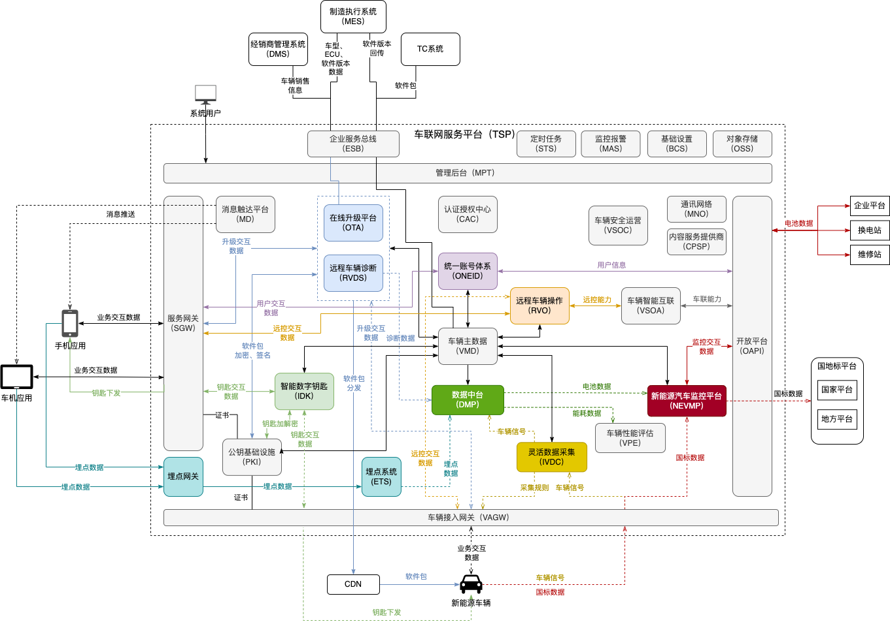

# iov-cloud
从零开始练手车联网云平台

# 功能架构

# 功能模块
|  模块   | 描述  |
|  ----  | ----  |
| VMD | 车辆主数据 |
| ONEID | 统一账号体系 |
| CAC | 认证授权中心 |
| OTA | 车辆在线升级 |
| RVDS | 远程车辆诊断 |
| IDK | 智能数字钥匙 |
| RVO | 远程车辆操作 |
| VSOC | 车辆安全运营 |
| VSOA | 车辆智能互联 |
| NEVMP | 新能源汽车监控 |
| VPE | 车辆性能评估 |
| IVDC | 灵活数据采集 |
| ETS | 埋点数据 |
| CPSP | 内容服务提供商 |
| MNO | 通讯网络 |
| MD | 消息触达 |
| DMP | 数据中台 |
| PKI | 公钥基础设施 |
| SGW | 服务网关 |
| VAGW | 车辆接入网关 |
| OAPI | 开放平台 |
| MPT | 管理后台 |
| ESB | 企业服务总线 |
| [OSS](https://github.com/hwyzleo/iov-cloud-oss)  | 对象存储 |
| STS | 定时任务 |
| MAS | 监控报警 |
| BCS | 基础设置 |